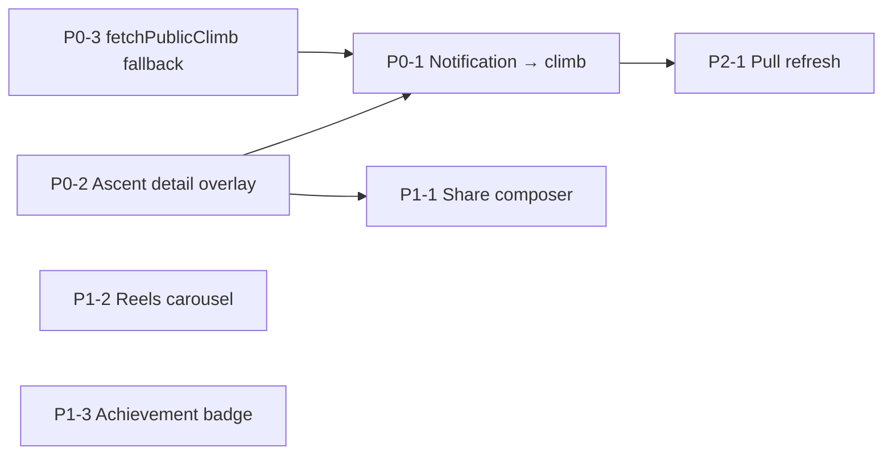

# Feed parity backlog (peen-web)

Production: `peen-landing-page/web-app/` · Mobile reference: `peen-ios/peen/`, `peen-android/…/ui/feed/`  
Parent doc: [WEB_APP_PARITY.md](./WEB_APP_PARITY.md)

Last updated: June 2026

## Summary

Core feed social actions (like, send-it, follow, wishlist, comments, scope tabs, infinite scroll, client filters) are **done on web**. Gaps are mostly **navigation**, **ascent-centric UI**, **notification deep links**, and **native-only polish** (reels, Instagram share, achievements on cards).

Priorities below use **P0** (broken parity / high user pain) through **P3** (nice-to-have or blocked on API).

---

## P0 — Fix broken parity (do first)

| # | Item | Why P0 | Mobile reference | Suggested web work |
|---|------|--------|------------------|-------------------|
| P0-1 | **Notification tap → climb in feed** | Like / comment / send-it notifications cannot open the send on web; iOS routes `entity_type: climb` to ascent detail | `PushNotificationManager` → `FeedNav.ascent` | Extend `App.tsx` `onNotificationNavigate`: `climb` → `/feed?climb={id}` (or ascent overlay). Reuse existing `FeedView` deep-link logic. |
| P0-2 | **Ascent / send detail screen** | Card tap on mobile opens send context (notes, photos, reactions); web only opens **route** overlay | iOS `FeedClimbDetailDestination`, Android `FeedClimbDetailScreen` | Add `AscentDetailOverlay` (or route) keyed by `climbId`: `social.fetchPublicClimb` / migration op `fetchPublicClimb`. Wire `FeedCard` route row vs card body: card → ascent, grade chip → route (match iOS). |
| P0-3 | **`fetchPublicClimb` when not in feed window** | Notification or share link may target a send outside loaded pages | `SocialFeedManager.fetchPublicClimb` | On deep link / notification, if pagination exhausts without match, call single-climb fetch then show ascent overlay (fallback before “not found”). |

**P0 exit criteria:** Tap a comment notification on web → land on the correct send with comments visible; tap feed card → ascent detail, not only route catalog page.

**Dependencies:** P0-1 depends on P0-2 or `?climb=` path; implement P0-3 with P0-1 for reliable notification UX.

---

## P1 — High-value parity (next sprint)

| # | Item | Why P1 | Mobile reference | Suggested web work |
|---|------|--------|------------------|-------------------|
| P1-1 | **Rich share for own sends** | Owners expect Instagram / copy caption flow after logging | iOS `ClimbShareComposerSheet`, Android `InstagramShareHelper` | Gate share menu to `isSelf`; add composer modal: copy link, copy caption, `navigator.share`, optional “open Instagram” (web-safe deeplink docs). Remove stub toasts for crew/message until real APIs exist. |
| P1-2 | **Community reels carousel** | Discoverability / parity with feed header on native | `CommunityReelsCarouselView`, `FeedReelsCarousel` | Migration: featured reels list (same as `InstagramFeaturedMediaService`). Horizontal scroll under feed tabs; open permalink in new tab. Feature flag if iOS uses `InstagramCommunityReelsFeature`. |
| P1-3 | **Featured achievement on feed cards** | Social identity on cards | `userFeaturedAchievementId` on `FeedClimbEntry` | Ensure `hydrateFeedPage` loads featured achievement ids (iOS `fetchFeaturedAchievementIds`). Small badge on `FeedCard` header. |
| P1-4 | **Achievements on public profile peek** | Opening climber from feed should match native profile depth | Android achievements overlay from feed; iOS `AchievementsStripCard` on `PublicClimberProfileView` | In `PublicProfilePeek`: fetch achievements + strip; “See all” can link to profile tab or modal grid (read-only). |

**P1 exit criteria:** Own-send share feels as useful as mobile (at least link + caption + system share); feed header shows reels when API returns data; cards and profile peek show featured achievement.

---

## P2 — UX polish & shell routing

| # | Item | Why P2 | Mobile reference | Suggested web work |
|---|------|--------|------------------|-------------------|
| P2-1 | **Pull-to-refresh on feed** | Expected mobile gesture; web only implicit refetch | iOS `.refreshable`, Android `PullToRefreshBox` | `queryClient.invalidateQueries` on feed + following + reels keys; optional touch pull library or manual “Refresh” in page head. |
| P2-2 | **Feed loading skeletons** | Perceived performance | `FeedCardSkeleton` | Reuse comment skeleton pattern; 3–4 placeholder cards while `!feedQ.data`. |
| P2-3 | **Notification → crew invite / belay** | iOS feed stack handles non-climb entities | `FeedNav.crewInvite`, `FeedNav.belayVerification` | Map `entity_type` in `onNotificationNavigate` to `/crew` + invite id or belay respond UI (may live under crew/profile, not feed route). |
| P2-4 | **Following tab: server-side scope (optional)** | Today both platforms filter client-side on loaded window; web copy warns “in loaded feed” | iOS `filterEntries` after `loadPublicFeed` | **API change:** `loadPublicFeed` param `scope=following` + cursor. Reduces confusion vs infinite scroll. Coordinate with `peen-api` / migration handler. |

**P2 exit criteria:** Refresh reloads feed without full page reload; loading state matches native feel; all notification entity types navigate somewhere sensible.

---

## P3 — API-dependent or lower priority

| # | Item | Why P3 | Notes |
|---|------|--------|-------|
| P3-1 | **Server-synced comment likes** | No backend table yet; iOS also lacks comment likes | Design in `WEB_APP_PARITY.md`; web has `localStorage` prototype in `commentLikes.ts` |
| P3-2 | **Comment threading (`parent_id`)** | Flat + @mention is current contract on web | Needs schema + mobile agreement |
| P3-3 | **Mute / report (real)** | Web menu shows toasts only; native feed has no mute/report | Product + moderation API before implementation |
| P3-4 | **“Send to crew” / “Send in message” from share** | Stub on web; partner messaging iOS-first | Blocked on [partner messaging parity](./WEB_APP_PARITY.md) |
| P3-5 | **Feed-specific notifications bell** | Web uses global shell bell — acceptable | Only revisit if feed becomes standalone layout |

---

## Web strengths (do not regress)

Keep these when shipping P0–P2:

- **Client filters** (style, grade, crag, when, sort) — native has scope tabs only
- **Inline comments + @reply** — native uses modal sheet
- **Infinite scroll** with cursor — iOS single page (~50)
- **Guest feed teaser** + sign-in gates
- **Double-tap photo like** + photo lightbox on cards

---

## Suggested implementation order

1. **P0-2** + **P0-3** (ascent overlay + single-climb fetch)  
2. **P0-1** (wire notifications)  
3. **P1-1**, **P1-3** (share + badge — small surface area)  
4. **P1-2**, **P1-4** (reels + profile achievements)  
5. **P2-*** as capacity allows  
6. **P3-*** when API/product ready  

---

## PR checklist (label `web-parity`)

- [ ] Migration op tested: `fetchPublicClimb`, `loadPublicFeed` cursor unchanged  
- [ ] `?climb=` still works after ascent overlay refactor  
- [ ] Notification samples: `climb`, `route`, `crew_invite` (if implemented)  
- [ ] Own-send vs other-send share behavior verified  
- [ ] No regression on `FeedFilterBar` / inline comments  

---

## Out of scope for this backlog

- Partner post compose / climb requests (see main parity doc)  
- Challenge route checklist on web  
- Push notifications in browser (web uses in-app drawer only)  

Track PRs with label **`web-parity`**; close items here when merged.
